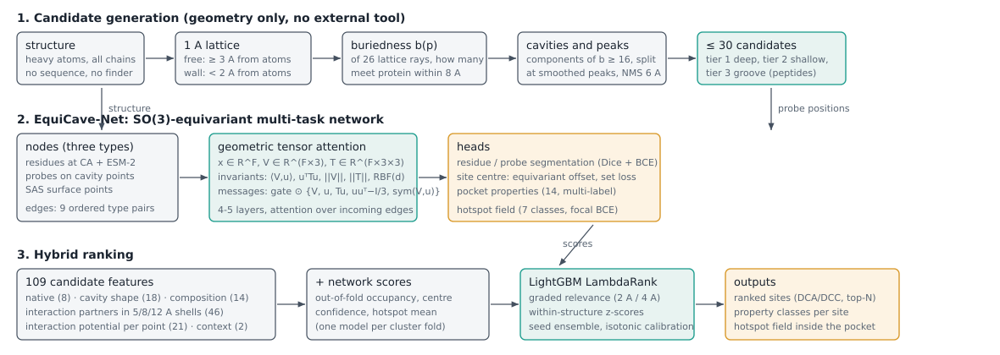

# EquiCave

Self-contained model of protein binding pockets. One structure in, three outputs:

Three operating modes (`equicave.modes`): **fast** for screening thousands of structures, **accurate** for a single
target you are designing against, **peptide** for peptide binders.

1. **Ranked binding sites** — own geometric candidate generator plus a learned re-ranker (and an equivariant network).
2. **Pocket property classes** — multi-label: ligand class, size, buriedness, polarity, charge.
3. **Hotspot field** — per grid point, the probability of a ligand atom of each chemical class. Labels are
   **interaction-validated**: a point counts only where the crystal ligand atom witnessing it really makes that
   contact with the receptor (H-bond, hydrophobic, stacking, salt bridge, halogen bond), optionally restricted to
   drug-like ligands.

Peptide binders have their own candidate tier (shallow elongated grooves) and their own benchmark.

**No P2Rank, fpocket or Java** anywhere in `src/` or `training/`; they exist only in `scripts/baselines/` for comparison.

## Measured results

All on RCSB structures split by 30 %-identity cluster, 5-fold cross-validation, 5 seeds, 95 % CI by cluster bootstrap.
Success = DCA ≤ 4 Å from a predicted centre to a ligand heavy atom. N = the structure's own number of ligand sites
(mean 2.27 here), so top-1 is the strictest column.

### Candidate generation, 1367 structures
| | ceiling | candidates | median best DCA |
|---|---|---|---|
| EquiCave detector (geometry only) | **0.977** | 30.0 | 0.65 Å |
| fpocket 4.x, same structures | 0.955 | 37.8 | — |
| P2Rank 2.5.1, same structures | 0.914 | 9.2 | — |

### Ranking on the leakage-free subset (432 structures, 383 clusters)
Measured with the 109-feature table; the feature table is now 118 columns (the interaction-potential group was
redefined after measurement showed it saturated) and these rows are being re-measured on it.
Structures sharing a 30 %-identity cluster with COACH420, HOLO4K, LIGYSIS, CryptoBench or a held-out family are
removed from training *and* from this cross-validation, so nothing here is memorised from a benchmark.

| method | top-1 | top-N | top-(N+2) | MRR |
|---|---|---|---|---|
| detector order | 0.516 [0.465, 0.565] | 0.641 | 0.812 | 0.654 |
| most buried first | 0.352 | 0.525 | 0.766 | 0.549 |
| LambdaRank, 109 features + z-scores | 0.782 [0.740, 0.823] | 0.835 | 0.925 | 0.848 |
| the same, seed ensemble | 0.792 [0.750, 0.832] | 0.845 [0.808, 0.880] | 0.928 [0.903, 0.953] | 0.853 |
| **+ ESM-2 features (288 columns)** | **0.809 [0.770, 0.847]** | **0.856 [0.820, 0.890]** | **0.928 [0.903, 0.953]** | **0.867** |

The language-model features are worth **+0.017 top-1 and +0.011 top-N** over the same model without them, which
matches the literature's finding that protein-language-model features buy more than any single architectural choice.
They are aggregated over the residues lining each candidate and reduced by a PCA fitted out of fold, so a tree model
can use them; no GPU and no trained network is involved.

Candidate ceiling 0.988. Calibration: expected calibration error 0.004 after isotonic regression against 0.034 for a
plain sigmoid of the score, with mean predicted 0.1805 against a base rate of 0.1806. The gain over the detector
order is +0.275 top-1 [+0.228, +0.329] by paired cluster bootstrap.

### Ranking, same 1367 structures and labels (earlier 32-feature model, retained for comparison)
| method | top-1 | top-(N+2) |
|---|---|---|
| detector order | 0.523 [0.494, 0.552] | 0.800 [0.777, 0.825] |
| most buried first | 0.368 [0.339, 0.396] | 0.762 [0.737, 0.787] |
| EquiCave + LambdaRank (32 features) | 0.724 [0.701, 0.748] | 0.877 [0.859, 0.896] |
| fpocket own ranking | 0.391 | — |
| P2Rank own ranking | 0.754 | — |
| EquiCave + LambdaRank (118 features) | rebuilding | rebuilding |
| EquiCave + network | not run (needs a GPU) | not run |

### COACH420 head-to-head, identical structures (`scripts/eval/compare_on_set.py`)
283 structures predicted by both methods, same ligand list and same labels. `not train-similar` excludes the
structures sharing a 30 %-identity cluster with our training manifest; that is leakage for us and not for P2Rank,
whose own training overlap with COACH420 this table does not measure, so it is the row to read for us.

| subset | method | predictions | ceiling | top-1 | top-N | top-(N+2) |
|---|---|---|---|---|---|---|
| not train-similar (174) | **EquiCave + ranker** | 29.9 | **0.992** | 0.707 [0.635, 0.773] | 0.741 [0.673, 0.807] | **0.908** [0.862, 0.948] |
| not train-similar (174) | P2Rank 2.5.1 | 9.6 | 0.931 | **0.753** [0.688, 0.814] | **0.828** [0.771, 0.881] | 0.879 [0.830, 0.926] |
| all (283) | EquiCave + ranker | 30.0 | 0.989 | 0.753 | 0.781 | 0.915 |
| all (283) | P2Rank 2.5.1 | 8.4 | 0.940 | 0.770 | 0.841 | 0.905 |

Paired cluster bootstrap on the comparable subset: top-1 −0.046 [−0.133, +0.035], top-N −0.086 [−0.169, −0.006],
top-(N+2) +0.029 [−0.030, +0.083]. So we are indistinguishable on top-1 and top-(N+2) and behind on top-N.

**Honest state:** detection is not the bottleneck and has not been for some time — our candidate set contains the
answer for 0.992 of those structures against P2Rank's 0.935. The bottleneck is first-rank accuracy: we convert 72 %
of our ceiling into a correct first prediction where P2Rank converts 82 % of its own. The obvious explanation,
that our 30 predictions fragment one pocket and eat the top-N budget, is **measured and false**: 210 of the 283
structures have one site, where top-N is top-1 and merging predictions cannot change anything, and that is where
the deficit is largest (`docs/results/README.md`). Two things address it and neither has been measured yet on a
benchmark — the per-point ligandability score (Stage 2b, in place, CPU-only) and the network's own per-probe
segmentation and confidence, which has never been trained because it needs a GPU.

### Held-out drug targets (12 families, excluded from training by cluster and UniProt)
| method | DCA top-1 | DCA top-(N+2) | DCC top-1 | ceiling |
|---|---|---|---|---|
| detector order | 0.917 [0.700, 1.000] | 1.000 | 0.500 | 1.000 |
| ranker (32-feature model) | 0.833 [0.583, 1.000] | 1.000 | 0.667 | 1.000 |

Twelve structures only, so the intervals are wide and the ranker being below the detector order here is not
significant. The DCC column (centre within 4 Å of the ligand *centroid*) is the harder criterion and the one the
ranker improves.

### Peptide-binding sites, 973 complexes / 685 receptor clusters (clusters disjoint from training)
Peptide chains are removed from the input. Cavity candidates reach ~0.94 ceiling, groove candidates ~0.78, so for
peptide sites detection is not the bottleneck — ranking is. Full table: `docs/results/`.

### Published numbers of other methods
In `docs/LITERATURE.md` and `docs/LITERATURE_SURVEY.md`, quoted from the papers and marked as such. They are **not**
comparable to the table above, and the survey shows how badly: fpocket, a fixed deterministic program, is reported at
56.4 %, 35.1 % and 22.8 % on "COACH420" by three different papers, because the ligand filter and chain handling
differ. 40 % of HOLO4K and 56 % of COACH420 structures even differ in chain count between the asymmetric and the
biological unit, and one 2026 paper excluded COACH420 outright because most of it was already in its training data.
So we re-run every baseline ourselves (`scripts/baselines/run_external.py`) and never copy a published row.

Protocol consequences we adopt from the independent LIGYSIS comparison: report top-N **and** top-(N+2), report DCC at
4 Å **and** 10-12 Å (4 Å is too strict for large ligands, and the reported advantage of equivariant detectors is
concentrated in DCC), report a **redundancy statistic** (67 % of one published method's predictions pointed at a site
it had already found), state the ligand rule and the resulting counts, and separate train-similar structures.

## Install and train

Step-by-step instructions for a new collaborator: [`RUN.md`](RUN.md).

```bash
make setup                              # pip install -e ".[dev,train,viz]"
bash scripts/train/train_all.sh         # the whole pipeline; GPU stages are skipped automatically on a CPU
```
`train_all.sh` is restartable (each stage is skipped when its output exists) and takes
`JOBS=`, `SEEDS=`, `RUNS=`, `NET_CFG=` and `STAGES=` overrides:

| stage | what it does | needs |
|---|---|---|
| `data` | RCSB manifest (CC0) and structures | network, ~20 min |
| `candidates` | native candidates, 118 features, labels | CPU, ~3.6 s/structure/core |
| `ranker` | LambdaRank, cluster CV, 5 seeds, ablations | CPU, minutes |
| `peptide` | peptide benchmark, groove candidates, peptide ranker | CPU |
| `labels` | property and hotspot label statistics | CPU |
| `net` | EquiCave-Net, fold 0, 3 seeds | **GPU** |
| `net-oof` | out-of-fold network features | **GPU** |
| `hybrid` | ranker with the network's scores | CPU |
| `ablations` | full / no_probes / no_surface / no_esm / no_tensors / invariant / achiral | **GPU** |
| `baselines` | fpocket and P2Rank on the same structures | `FPOCKET=`, `PRANK=`, Java |
| `eval` | held-out, COACH420, HOLO4K with one protocol | CPU |

```bash
STAGES="net net-oof hybrid ablations" JOBS=8 bash scripts/train/train_all.sh   # a GPU box
FPOCKET=/opt/fpocket PRANK=/opt/p2rank/prank STAGES=baselines bash scripts/train/train_all.sh
```
Individual stages are also `make` targets (`make candidates`, `make ranker`, `make net`, ...) and
`python -m training list` shows the three training tasks. `notebooks/equicave_train.ipynb` runs everything with figures.

## Layout
| path | contents |
|---|---|
| `src/equicave/` | `detect` (candidates), `peptide` (grooves), `pockets` (grid, buriedness, SAS), `pocket_features` (118 ranker features), `labels` (+ interaction validation), `ccd`, `metrics`, `structure`, `viz`, `mcp_server` |
| `training/` | `pockets/model.py` (EquiCave-Net), `data.py`, `net_task.py`, `labels_task.py`, `configs/`, `environment.yml`, `Dockerfile` |
| `scripts/` | `data/` (manifests, structures, benchmark lists), `train/`, `eval/`, `baselines/` |
| `data/processed/` | small tables only; structures and third-party data are rebuilt, never committed |
| `docs/` | `ARCHITECTURE.md`, `PLAN_2026.md`, `PAPER_PLAN.md`, `DATA_CARD.md`, `LITERATURE.md`, `PROVENANCE.md`, `results/` |

## Architecture



Full specification with every constant and loss: [`docs/ARCHITECTURE.md`](docs/ARCHITECTURE.md).

### 1. Candidate generation from lattice closure

The receptor is embedded in an absolute cubic lattice of step 1 Å (multiples of the step, so the same protein always
yields the same points). One nearest-neighbour query per lattice point against the heavy atoms gives a distance field
`d(p)`, from which two masks follow: *free* points with `d(p) ≥ 3.0 Å`, where a ligand heavy atom could sit, and
*wall* points with `d(p) < 2.0 Å`, which a ray can hit. Closure of a free point is then

&nbsp;&nbsp;&nbsp;&nbsp;`b(p) = Σ_{k=1..26} 1[ ∃ t ≥ 1 : t·|e_k|·1Å ≤ 8 Å ∧ wall(p + t·e_k) ]`,

the number of the 26 lattice directions `e_k` along which protein is met within 8 Å. On the lattice this is a sum of
26 shifted boolean ORs rather than 26 × 8 per-point queries, which is why a whole protein takes about 3.6 s on one
core; the lattice form is verified against an exact ray caster (`tests/test_detect.py`: r > 0.95, mean absolute
deviation < 2 of 26 rays). Cavities are the 26-connected components of `b(p) ≥ 16`, each split into sub-sites at peaks
of the Gaussian-smoothed closure field with 6 Å non-maximum suppression; every cavity point is assigned to its nearest
peak, a group of ≥ 12 points is a candidate, its score is `Σ b(p)` and its centre the closure-weighted centroid. If
fewer than 30 candidates result, a second tier at `b(p) ≥ 10` fills the remaining slots with shallower cavities whose
centres are farther than 6 Å from every deep candidate. Peptide grooves form a third tier: closure ≥ 10, local peaks
with 5 Å suppression, each grown to the patch points within 7 Å and kept only if it is elongated (longest principal
extent ≥ 9 Å, anisotropy `ax₁/ax₃ ≥ 1.5`), scored by `Σ b(p) · min(anisotropy, 6)`.

Thresholds were calibrated once on 55 structures before any ranking model existed (ceiling 0.891 / 0.945 / **0.964** /
0.927 / 0.926 for closure 12 / 14 / 16 / 18 / 20, and 0.982 with the shallow tier added) and then frozen; they are
recorded next to every trained model and checked at load time, so inference cannot drift from training.

### 2. EquiCave-Net: an SO(3)-equivariant multi-task network

The graph has three node types: **residues** at Cα with frozen ESM-2 embeddings, one-hot identity, b-factor z-score and
local density; **probes** on free cavity lattice points, carrying their own closure, depth and neighbour counts;
**surface** points sampled on the solvent-accessible surface (Shrake–Rupley, vdW + 1.4 Å), carrying the element and
residue of the atom they belong to. Edges are k-nearest within a per-pair radius for each of the nine ordered type
pairs, and the pair identity is embedded. Placing probes on real cavity points, rather than on a sphere around the
protein as VN-EGNN does, means every virtual node starts where a ligand atom could actually be.

Each node carries three fields of `F` channels: scalars `x ∈ ℝ^F` (degree 0), vectors `V ∈ ℝ^{F×3}` (degree 1,
transforming as `V ↦ V Rᵀ`) and symmetric traceless tensors `T ∈ ℝ^{F×3×3}` (degree 2, `T ↦ R T Rᵀ`), initialised from
backbone directions, probe-to-atom directions and surface normals. For an edge `j → i` with `r = p_i − p_j`, `d = |r|`,
`u = r/d`, the invariant stream contains only rotation-invariant quantities,

&nbsp;&nbsp;&nbsp;&nbsp;`inv_ij = [ x_i, x_j, RBF(d), E(type), ⟨V_j, u⟩, ‖V_j‖, uᵀ T_j u, ‖T_j‖_F ]`,

from which an MLP produces attention logits (softmaxed over the incoming edges of each node) and scalar gates. The
messages use only equivariant primitives, each multiplied by such a gate:

&nbsp;&nbsp;&nbsp;&nbsp;`Δx_i = Σ_j a_ij [ g¹⊙W_x x_j + g²⊙⟨V_j,u⟩ + g³⊙(uᵀT_j u) ]`
&nbsp;&nbsp;&nbsp;&nbsp;`ΔV_i = Σ_j a_ij [ g⁴⊙W_v V_j + g⁵⊙u + g⁶⊙T_j u ]`
&nbsp;&nbsp;&nbsp;&nbsp;`ΔT_i = Σ_j a_ij [ g⁷⊙W_t T_j + g⁸⊙(uuᵀ − I/3) + g⁹⊙sym₀(V_j, u) ]`

where `sym₀(a,b) = ½(abᵀ + baᵀ) − ⅓(a·b)I`. These are the Cartesian equivalents of the Clebsch–Gordan couplings up to
`l = 2` (`1⊗1→0`, `1⊗1→2`, `2⊗1→1`, `2⊗1→0`), so no spherical-harmonic machinery or external equivariance library is
needed. A node-wise refinement then gates equivariant self-interactions (`V ← V + g⊙T V`, `T ← T + g⊙sym₀(V,V)`) by the
node's own invariants and, optionally, by pseudo-scalar triple products `⟨V_a × V_b, V_c⟩`, which change sign under
reflection: with them the network is SO(3)- but not O(3)-equivariant, so chirality is visible. Scalars are
layer-normalised, vector and tensor channels RMS-normalised per node. Equivariance is verified numerically for every
head (random rotation and translation, tolerance 1e-4), together with a mirror test that the achiral variant is
reflection-invariant and the chiral one is not.

Five heads share the trunk: residue and probe segmentation (Dice + BCE), a site centre read out as an **equivariant
vector offset** from `V` and trained with a set loss over all sites of the structure (each true site is approached by
its nearest probe within 8 Å) plus a confidence head, a 14-class multi-label property head over probes pooled by site
membership, and the 7-class hotspot field (focal BCE). Ablation switches isolate every design decision at equal depth
and width: probes, surface module, ESM-2, tensor channels (degree ≤ 1), vector channels, full invariance
(distances only) and chirality.

### 3. Hybrid ranking

Each candidate is described by 109 numbers, none of them protein-family specific: the candidate as the generator made
it (8), the shape of its cavity (18), the atom and residue composition of its environment (14), the receptor
interaction partners it offers in 5, 8 and 12 Å shells (46: donors, acceptors, cations, anions, aromatic ring atoms and
hydrophobic carbons, as counts and fractions, with hydropathy, b-factor and balance ratios), the **interaction
potential of its own points** (21: per cavity point, which interaction a ligand atom placed there could actually make,
summarised over the cavity) and two context numbers. Out-of-fold network scores join them when a trained model exists.
A LightGBM LambdaRank model consumes these with graded relevance (2 within 2 Å of a ligand atom, 1 within 4 Å),
within-structure z-scores of every feature, and a seed ensemble; the cross-validation winner among LambdaRank, a
listwise transformer and stacking is kept, followed by isotonic calibration.

## Data and licences
Training data: RCSB PDB and the wwPDB Chemical Component Dictionary (CC0). ESM-2 weights: MIT. Benchmark lists are
fetched from their original sources by the scripts and never redistributed here. Details and leakage controls:
`docs/DATA_CARD.md`. Scores are computational hypotheses, not measured activity. The repository is private and has no
open-source licence yet.
